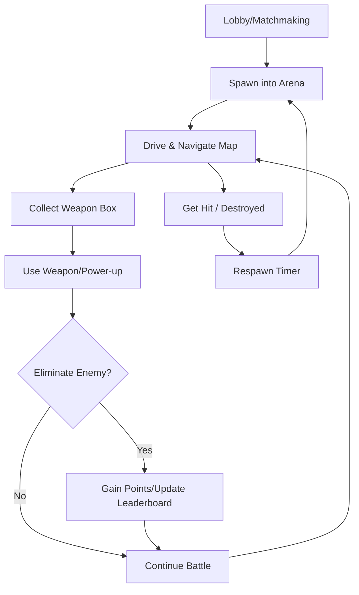
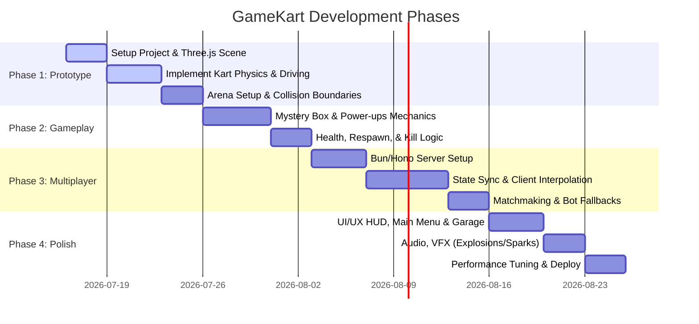

# Product Requirements Document: GameKart (SmashKarts.io Clone in Three.js)

GameKart is a fast-paced, browser-based 3D multiplayer kart battle arena game. Players drive customizable karts, pick up mystery boxes containing weapons/power-ups, and eliminate rivals to top the leaderboard in a confined arena.

---

## 1. Product Overview

- **Core Gameplay**: 3D kart driving with battle-royale/deathmatch mechanics in an arena.
- **Client Technology**: HTML5, CSS3, JavaScript/TypeScript, **Three.js** (WebGL 3D Rendering), **cannon-es** (Physics Engine).
- **Server Technology**: **Bun** with **Hono** and **Native WebSockets** for real-time multiplayer synchronization.
- **Target Platform**: Desktop and mobile web browsers (responsive control layouts).

---

## 2. Core Game Loop & Features



### 2.1 Kart Physics & Controls
*   **Driving Mechanics**: Realistic but arcade-style controls including acceleration, reverse, steering (turning radius affected by speed), braking, and drifting.
*   **Collision Detection**: Rigid body collisions between karts, walls, ramps, and obstacle objects using a lightweight 3D physics library (`cannon-es`).
*   **Respawn System**: Upon destruction, karts respawn at random predefined checkpoints after a 3-second delay, with a brief window of invincibility.

### 2.2 Kart Design & Animations
*   **Kart Model Structure**: Low-poly kart chassis with four independent wheel nodes. Front wheel nodes swivel on the local Y-axis during steering; all four wheels rotate on the local X-axis proportional to kart speed.
*   **Exhaust & VFX points**: Located at the rear exhaust pipes to emit transparent smoke particles when driving, fire sparks during Nitro boosts, and grey tire trails during drifts.
*   **Character Rigging & Animations (Mixamo Integration)**:
    *   *Driving Idle*: Dynamic seated pose with minor steering adjustments.
    *   *Steering Lean*: Blended skeletal rotation to make the character lean left/right with steering input.
    *   *Stun/Spin Animation*: Played when hit by a weapon, spinning the character mesh.
    *   *Victory/Podium Dance*: A loopable celebration animation for top players at match end.

### 2.3 Battle Arenas (Maps)
*   **Default Map (The Colosseum)**: A walled battle arena with ramps, platforms, pillars for cover, and scattered item spawn points.
*   **Visual Assets**: Low-poly 3D models for karts, characters, obstacles, and items to ensure rapid loading and smooth frame rates (60 FPS) on low-end devices.

### 2.4 Weapon & Power-up System
Mysterious item boxes float at various nodes in the arena and respawn 5 seconds after collection. Picking up a box grants a random weapon/power-up shown in an active item slot:

| Weapon/Power-up | Type | Description |
| :--- | :--- | :--- |
| **Rocket (Homing/Straight)** | Projectile | Launches a projectile forward. Deals high splash damage on impact. Homing rockets lock onto the nearest target. |
| **Machine Gun** | Rapid Fire | Fires rapid-fire, low-damage bullets in a straight line with light knockback. |
| **TNT / Landmine** | Deployable | Dropped behind the kart. Explodes when run over by an enemy, dealing high damage and launching the kart upward. |
| **Shield Generator** | Passive | Surrounds the kart with a bubble shield that absorbs all damage from the next 2 hits or lasts 10 seconds. |
| **Nitro Boost** | Speed Upgrade | Provides a sudden, intense speed boost for 3 seconds, allowing players to ram into enemies for knockback. |

### 2.5 Multiplayer & Networking
*   **Client-Server Architecture**: Authoritative server model to prevent cheating (speed hacks, teleporting).
*   **State Synchronization**: 
    *   **Client-Side Prediction**: Client renders driving input immediately to ensure zero-latency responsiveness.
    *   **Server Reconciliation**: Server computes authoritative physics and sends corrections back to clients.
    *   **Entity Interpolation**: Smoothly interpolates the positions of other karts and projectiles to compensate for latency and packet loss.
*   **Matchmaking**: Lobby rooms holding up to 12 players at once. If a room is not full, AI bots are spawned to fill the empty slots.

### 2.5 User Interface (UI/UX)
*   **Heads-Up Display (HUD)**:
    *   Active Weapon Slot (displays currently held weapon).
    *   Health Bar (0-100 HP) and Shield status.
    *   Speedometer.
    *   Mini-map displaying relative positions of other players.
    *   Real-time Leaderboard (top 5 players ranked by kills).
    *   Kill Feed (e.g., *Player1 blasted Player2 with Rocket*).
*   **Main Menu**:
    *   Play Game button.
    *   Garage: Customize kart color and select character skins.
    *   Settings: Toggle SFX/Music, customize control bindings, and adjust graphic quality.

---

## 3. Technical Stack & Asset Pipeline

### 3.1 Software & Libraries
*   **Bundler & Dev Server**: Vite (for fast hot-reloading and building optimized production bundles).
*   **Rendering Pipeline**: Three.js (utilizing WebGLRenderer, PerspectiveCamera, Custom Follow Camera, AmbientLight, DirectionalLight with shadows).
*   **Physics Engine**: `cannon-es` (JavaScript port of Cannon.js, lightweight, optimized for simple 3D bounding boxes and spheres).
*   **Networking**: Native WebSockets (browser WebSocket API on frontend, native Bun WebSockets on backend).
*   **Styling**: Modern CSS for UI overlays (glassmorphism, custom typography, smooth transitions).

### 3.2 Asset Pipeline & Creation Tools
*   **3D Modeling & Scene Composition**: **Blender**
    *   Used for optimizing meshes, setting up materials, checking vertex counts, and exporting to optimized `.gltf` / `.glb` formats.
*   **Rigging & Character Animation**: **Mixamo**
    *   Used to download pre-rigged low-poly humanoid characters and auto-generate basic animations (such as driving posture, steering lean, victory dance, and impact reaction).
*   **Prototype & Final 3D Assets**: **Kenney Assets** (e.g., Kenney's "Karting Kit", "Toy Kit", or "Space Kit")
    *   Used for high-quality, public-domain low-poly assets including karts, wheels, tracks, barriers, ramps, weapons, and collectible boxes, enabling fast prototyping and a cohesive aesthetic.

---

## 4. Development Roadmap



---

## 5. File Structure Suggestion

```text
GameKart/
├── public/                 # Static assets (Models, Textures, Audio)
├── src/
│   ├── client/             # Frontend Three.js Application
│   │   ├── components/     # UI Overlays (HUD, Menu, Garage)
│   │   ├── physics/        # Physics engine setup and integration
│   │   ├── entities/       # Kart, Weapon, Obstacle classes
│   │   ├── scene/          # World building, lighting, cameras
│   │   ├── network/        # Socket connection & prediction code
│   │   ├── main.js         # Client entrypoint
│   │   └── style.css       # HUD & overlay styles
│   └── server/             # Bun/Hono Server Application
│       ├── rooms/          # Room & matchmaking management
│       ├── physics/        # Server-side authoritative physics
│       └── server.js       # Server entrypoint
├── package.json
└── product.md              # This file
```
